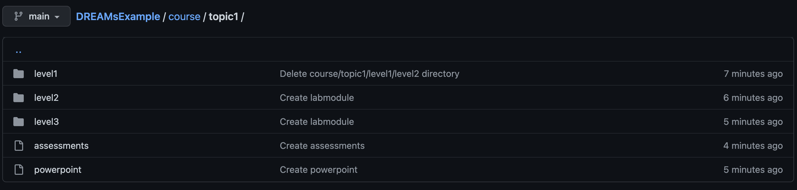

# DREAMs Learning Object Course Hierarchy Example

One learning object would be the course. It would host the instructors manual and VM installation software. 

There would be a learning object for each topic, represented by a unit or module depending on size of the topic. It would host the topic's powerpoint lectures and assessments. Each topic object is a child to the course object.

There would be a learning object for each level such as levels 1 through 3. It would host the lab module, the worksheek, and the worksheet solutions. Each level is a child to its respective topic object.
